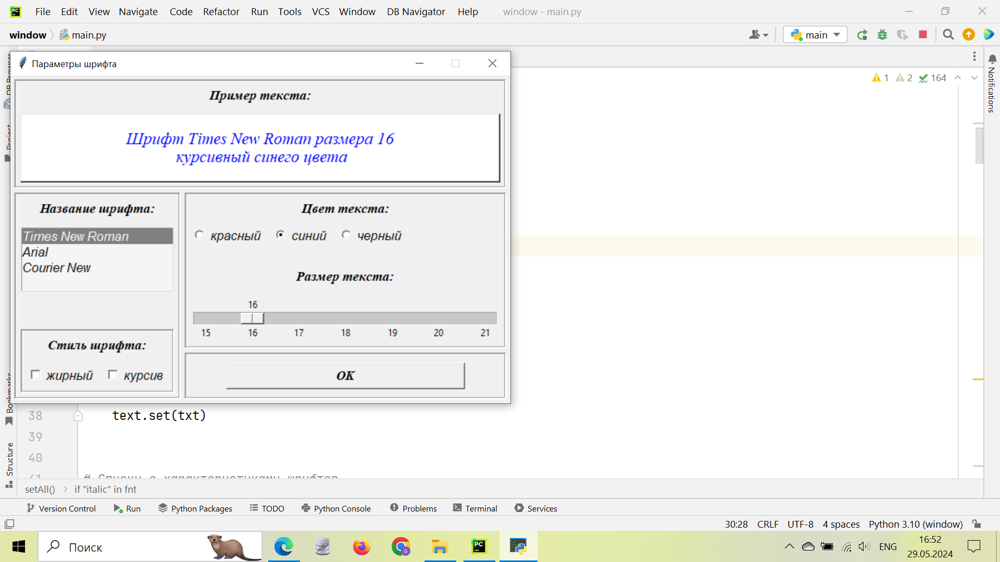
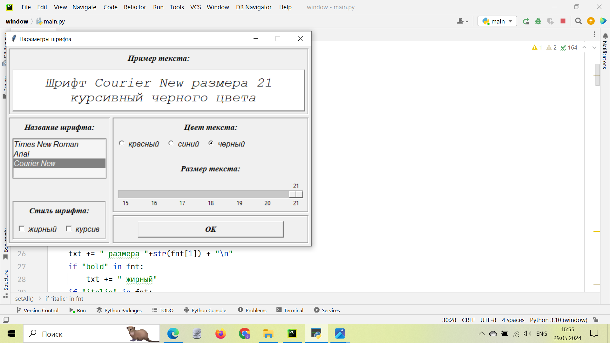

# Window на tkinter

___
При запуске программы открывается окно, в котором при помощи таких графических компонентов, как опции, переключатели, слайдер и статический список можно изменять графические характеристики текста, выводимого в окне.

## Описание

В верхней части окна размещена панель с надписью ___Пример текста:___
и белой областью с текстом. Текст отображается синим цветом курсивным шрифтом __Times New Roman__ размера __16__. Сам текст 
содержит эту информацию.  
В левой части окна расположена панель с надписью __Название шрифта__ и списком для выбора названия шрифта из трех пунктов.  
В нижней части этой панели, под надписью __Стиль шрифта__, расположены две опции для выбора стиля шрифта.         

Справа в области окна под надписью __Цвет текста__ расположена панель 
с группой переключателей (__красный__, __синий__ и __черный__ — по умолчанию 
выбран пункт __синий__), предназначенных для выбора цвета шрифта. Также панель под надписью __Размер текста__ содержит слайдер для выбора 
размера шрифта. Далее внизу размещена еще одна панель с кнопкой __ОК__, 
нажатие которой приводит к закрытию окна. 

При изменении настроек в окне, изменения автоматически вносятся 
в шаблонный текст: меняется как содержимое текста, так и шрифт, которым отображается этот текст (в том числе и цвет текста). 


### Склонируйте проект к себе на компьютер с GitHub:
```python
git clone https://github.com/GeorgeTra/window_tkinter.git
```

### Перейдите в папку проекта:
```python
cd window_tkinter 
```

Создайте необходимую ветку и перейдите на неё:
```python
git checkout main   
```

Создайте виртуальное окружение:
```python
python -m venv venv   
```

Активируйте виртуальное окружение:
```python
venv\Scripts\activate 
```

### Запуск приложения
- Выполните команду в терминале
```
python main.py
```

- Вариант окна 1:
 

- Вариант окна 2:
 

- Вариант окна 3:
 
- 